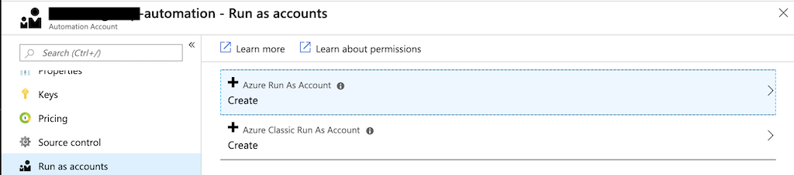
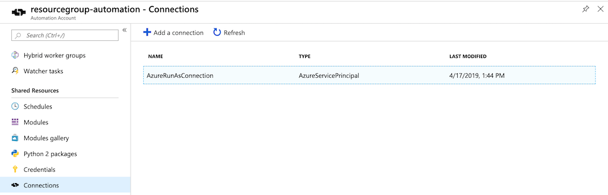

# Set-PanExternalDynamicIpLists

### Login
```powershell
Connect-AzAccount -SubscriptionName "{{ SubscriptionName }}"

$AZURE_SUBSCRIPTION_ID =(Get-AzContext).Subscription.Id
$AZURE_CONTEXT_ACCOUNT_ID = (Get-AzContext).Account.Id
```

## Create Resource Group
```powershell
mkdir ./scratch
$AZURE_APPLICATION_NAME = 'paniplist'

$splat = {}
$splat = @{
  Path = "./templates/resourcegroup/azuredeploy.parameters.json"
  Destination = "./scratch/azuredeploy.${AZURE_APPLICATION_NAME}.resourcegroup.parameters.json"
}
Copy-Item @splat

# Edit "./templates/resourcegroup/azuredeploy.$AZURE_APP_NAME.resourcegroup.parameters.json"
# Fill in correct parameter values

# Deploy a new resource group

$AZURE_DEPLOYMENT_LOCATION = 'eastus2'

$splat = @{}
$splat = @{
  Location = $AZURE_DEPLOYMENT_LOCATION
  TemplateFile = "./templates/resourcegroup/azuredeploy.json"
  TemplateParameterFile =  "./scratch/azuredeploy.${AZURE_APPLICATION_NAME}.resourcegroup.parameters.json"
}
$AZURE_RG_DEPLOYMENT = New-AzDeployment @splat
$AZURE_RESOURCE_GROUP = $AZURE_RG_DEPLOYMENT.Outputs.resourceGroupName.Value
```

## Create Azure Automation Account

```powershell
# Create a new Azure Automation Account
$splat = @{}
$splat = @{
  Name = "$AZURE_APPLICATION_NAME-automation"
  ResourceGroupName = "$AZURE_RESOURCE_GROUP"
  Location = "$AZURE_DEPLOYMENT_LOCATION"
  Plan = "basic"
}
$AZURE_AUTOMATION_ACCOUNT = New-AzAutomationAccount @splat

$AZURE_AUTOMATION_ACCOUNT_NAME = $AZURE_AUTOMATION_ACCOUNT.AutomationAccountName
```
Next, a new **Run as Account** will need to be created.

To continue, navigate to the Azure Portal page for the automation account **panostg-automation** and select **Run as accounts** under **Account Settings**. Click on **Azure Run as Account**.



Click **Create** on the following blade:


This will result in a new **Azure Automation Run As Account**:


A corresponding **AzureRunAsConnection** will be created also and can be viewed under the **Shared Resources** of the ***resourcegroups-automation** Azure Automation Account:



Once the account has been created, it must be assigned the proper role over the subscription. A Runas Automation account typically posseses `Contributor` over the scope of the subscription. Since this runbook will read information regarding the ip addresses, it will be given `Reader`, instead over a list of managed subscriptions.

```powershell
# Get ObjectId of the service principal associated with
# the Azure Automation RunAs account.
# When a RunAs account is created, it is registered as an Azure Ad application.
# An Azure Ad application has an associated Service Principal.
# The ObjectId of the associated Service Principal is required to assign an Azure AD role.

$AZURE_AUTOMATION_RUNASACCOUNT_SP = Get-AzADServicePrincipal -DisplayNameBeginsWith $('{0}_' -f $AZURE_AUTOMATION_ACCOUNT_NAME)

$AZURE_AUTOMATION_RUNASACCOUNT_SP_OBJID = $AZURE_AUTOMATION_RUNASACCOUNT_SP.Id

# Get all subscriptions that you have access to
$AZURE_SUBSCRIPTION_IDS = Get-AzSubscription | % {$_.SubscriptionId}

$splat = @{}
$splat =  @{
  ObjectId = "$AZURE_AUTOMATION_RUNASACCOUNT_SP_OBJID"
  RoleDefinitionName = 'Reader'
}

$AZURE_SUBSCRIPTION_IDS | % {
  New-AzRoleAssignment @splat -Scope $('/subscriptions/{0}' -f $_)
}

$splat = @{}
$splat = @{
  ObjectId = "$AZURE_AUTOMATION_RUNASACCOUNT_SP_OBJID"
  RoleDefinitionName = 'Contributor'
  Scope = $('/subscriptions/{0}' -f $AZURE_SUBSCRIPTION_ID)
}

Remove-AzRoleAssignment @splat

```

After the automation account has been created, the required `Az` Powershell modules must be added to the automation account.

```powershell
# Add Necessary Az modules
# The `Az.Accounts` module must the first module imported into the automation account

Find-Module -Name 'Az.Accounts' | ForEach {
    New-AzAutomationModule -AutomationAccountName $AZURE_AUTOMATION_ACCOUNT_NAME `
                           -ResourceGroupName $AZURE_RESOURCE_GROUP `
                           -ContentLink $('{0}/package/{1}/{2}' -f $_.RepositorySourceLocation, $_.Name, $_.Version) `
                           -Name $_.Name
}

# Once this module has been imported, the other required modules are imported
$AZURE_AUTOMATION_MODULES = @(
    'Az.Compute',
    'Az.Network',
    'Az.Resources',
    'Az.Storage'
) | ForEach {Find-Module -Name $_ -Repository PSGallery}

$splat = @{}
$splat = @{
  AutomationAccountName = "$AZURE_AUTOMATION_ACCOUNT_NAME"
  ResourceGroupName = "$AZURE_RESOURCE_GROUP"
}
$AZURE_AUTOMATION_MODULES | ForEach {
    New-AzAutomationModule @splat `
    -ContentLink "$('{0}/package/{1}/{2}' -f $_.RepositorySourceLocation, $_.Name, $_.Version)" `
    -Name $_.Name
}

# Import runbook:
$splat = @{}
$splat = @{
  Path = ".\runbook\webhook-version\Set-YalePanExternalDynamicIpLists.ps1"
  ResourceGroupName = "$AZURE_RESOURCE_GROUP"
  AutomationAccountName = "$AZURE_AUTOMATION_ACCOUNT_NAME"
  Type = "PowerShell"
  LogVerbose = $True
}
$AZURE_RUNBOOK = Import-AzAutomationRunbook @splat -Force

# Publish runbook
Publish-AzAutomationRunbook -Name $AZURE_RUNBOOK.Name `
                            -ResourceGroupName $AZURE_RESOURCE_GROUP `
                            -AutomationAccountName $AZURE_AUTOMATION_ACCOUNT_NAME

```

## Create Storage Account

An Azure Storage Account will be created to contain Azure blob storage for the external dynamic IP lists.

```powershell
# Create a storage account to park artifacts used by the Automation account
# Add deployment parameters to existing hashtable specific to Storage

$splat = {}
$splat = @{
  Path = "./templates/storageaccount/azuredeploy.parameters.json"
  Destination = "./scratch/azuredeploy.${AZURE_APPLICATION_NAME}.storageaccount.parameters.json"
}
Copy-Item @splat

# Edit "./templates/resourcegroup/azuredeploy.$AZURE_APP_NAME.storageaccount.parameters.json"
# Fill in correct parameter values


$splat = @{}
$splat = @{
  Name = "storageaccount-$(Get-Date -Format 'yyMMddHHmmm')-deployment"
  ResourceGroupName = "$AZURE_RESOURCE_GROUP"
  TemplateFile = "./templates/storageaccount/azuredeploy.json"
  TemplateParameterFILE = "./scratch/azuredeploy.${AZURE_APPLICATION_NAME}.storageaccount.parameters.json"
}
$AZURE_DEPLOYMENT_STORAGE_ACCOUNT = New-AzResourceGroupDeployment @splat

$AZURE_STORAGE_ACCOUNT_NAME = $AZURE_DEPLOYMENT_STORAGE_ACCOUNT.Outputs.storageAccountName.Value

# Azure AD credentials can be used to establish a storage context
$AZURE_STORAGE_CONTEXT_AAD = New-AzStorageContext -StorageAccountName "$AZURE_STORAGE_ACCOUNT_NAME" `
                        -UseConnectedAccount

$AZURE_STORAGE_CONTAINER_NAME = 'pan-itsfts'

$AZURE_STORAGE_CONTAINER = New-AzStorageContainer -Context $AZURE_STORAGE_CONTEXT_AAD `
                                                  -Permission Off `
                                                  -Name "$AZURE_STORAGE_CONTAINER_NAME"

# Set Storage Blob Data Owner role for current user over the newly created container
$splat=@{}
$splat = @{
  SignInName = $AZURE_CONTEXT_ACCOUNT_ID
  RoleDefinitionName = "Storage Blob Data Owner"
  Scope = (("/subscriptions/{0}" + `
             "/resourceGroups/{1}" + `
             "/providers/Microsoft.Storage/storageAccounts/{2}" + `
             "/blobServices/default/containers/{3}") `
             -f $AZURE_SUBSCRIPTION_ID, $AZURE_RESOURCE_GROUP, $AZURE_STORAGE_ACCOUNT_NAME, $AZURE_STORAGE_CONTAINER_NAME)
}

New-AzRoleAssignment @splat
# NB, This will take a few minutes to propogate

# Test by repeating the followinng until success

Set-AzStorageBlobContent `
  -Context $AZURE_STORAGE_CONTEXT_AAD `
  -Container "$AZURE_STORAGE_CONTAINER_NAME" `
  -File "./templates/resourcegroup/azuredeploy.json" `
  -Blob 'templates/resourcegroup/azuredeploy.json' `
  -Properties @{"ContentType" = "text/plain;charset=ansi"}

# You can run the runbook here to populate the blobs and test locally
# Powershell runbooks driven by events or schedules take a single parameter:
# `-Webhook`
# This is a JSON payload that serializes the Powershell parameters.
# Two versions of the script are furnished:
# 1. A version that utiliizes conventional Powershell commandlet parameters and is intended to be executed interactively. These are furnished in the task blade.
# 2. A version that wraps these parameters as a webhook to be delivered by a scheduled event or Logic App step.
# Since this will run as a scheduled event we will import the webhook version.
# We will test this version locally.

# Grab all of the Subscription Ids to which the runbook automation was assigned a reader role
$AZURE_SUBSCRIPTION_IDS = $(Get-AzSubscription).Id

# Construct the test webhook payload by dot source the payload script:
. ./runbook/webhook-version/Set-TestWebhookVariable.ps1

# Check that SubscriptionIds, StorageAccount, and StorageContainer have correct values:
$testWebhook.RequestBody

./runbook/webhook-version/Set-YalePanExternalDynamicIpLists.ps1 -Webhook $testWebhook -Verbose

# Test

# Nonwebhook version:
# ./runbook/nonwebhook-version/Set-YalePanExternalDynamicIpLists.ps1 -SubscriptionIds @('all') `
#                                            -StorageAccount "$AZURE_STORAGE_ACCOUNT_NAME" `
#                                            -StorageContainer "$AZURE_STORAGE_CONTAINER_NAME" #`
#                                            -Verbose

# This script was executed under our current logged in AAD context and we have ownership over
# the storage account blobs.

# We must set Storage Blob Contributor role for RunAs account to allow the runbook to update blobs
$splat=@{}
$splat = @{
  ObjectId = "$AZURE_AUTOMATION_RUNASACCOUNT_SP_OBJID"
  RoleDefinitionName = "Storage Blob Data Contributor"
  Scope = (("/subscriptions/{0}" + `
             "/resourceGroups/{1}" + `
             "/providers/Microsoft.Storage/storageAccounts/{2}" + `
             "/blobServices/default/containers/{3}") `
             -f $AZURE_SUBSCRIPTION_ID, $AZURE_RESOURCE_GROUP, $AZURE_STORAGE_ACCOUNT_NAME, "pan-itsfts")
}

New-AzRoleAssignment @splat
```

```powershell
# To create Shared Access tokens, the account key, not AAD, context must be used

$AZURE_STORAGE_KEY = $(Get-AzStorageAccountKey -Name "$AZURE_STORAGE_ACCOUNT_NAME" -ResourceGroupName "$AZURE_RESOURCE_GROUP" | ? {$_.KeyName -eq 'key1'}).Value

$AZURE_STORAGE_CONTEXT = New-AzStorageContext -StorageAccountName "$AZURE_STORAGE_ACCOUNT_NAME" `
                        -StorageAccountKey "$AZURE_STORAGE_KEY"

# Create Shared Access Tokens for use by the PaloAlto
# Create 1 year expiry date from now

$StartTime = Get-Date
$ExpiryTime = $StartTime.AddYears(1)


# **NB**, RECORD THIS VALUE IN A A SECRET VAULT. IF LOST, IT MUST BE REGENERATED.
#$AZURE_STORAGE_SAS_TOKEN = New-AzStorageContainerSASToken @splat

$AZURE_PAN_EDL_BLOBS = Get-AzStorageBlob -Container $AZURE_STORAGE_CONTAINER_NAME -Context $AZURE_STORAGE_CONTEXT -Prefix 'ZoneLists'

$splat = @{}
$splat = @{
  Context = $AZURE_STORAGE_CONTEXT
  Container = "$AZURE_STORAGE_CONTAINER_NAME"
  Permission = 'rl'
  StartTime = $StartTime
  ExpiryTime = $ExpiryTime
}

$AZURE_PAN_EDL_BLOBS = Get-AzStorageBlob -Container $AZURE_STORAGE_CONTAINER_NAME `
                      -Context $AZURE_STORAGE_CONTEXT `
                      -Prefix 'ZoneLists'

$AZURE_BLOB_SASTOKENS = $AZURE_PAN_EDL_BLOBS | ForEach-Object {
  $uri = $_.ICloudBlob.StorageUri.PrimaryUri.AbsoluteUri
  $sASToken = New-AzStorageBlobSASToken @splat -Blob $_.Name
  $("{0}{1}" -f $uri, $sASToken)
}

Out-File $AZURE_BLOB_SASTOKENS -Path './scratch/SASTokens.txt' -Encoding ascii

# This file contains the uri and access tokens for the external data list files.
# Keep this safe.

```


```powershell
$splat = {}
$splat = @{
  Path = "./templates/opinsightworkspace/azuredeploy.parameters.json"
  Destination = "./scratch/azuredeploy.${AZURE_APPLICATION_NAME}.workspace.parameters.json"
}
Copy-Item @splat

$splat= {}
$splat = @{
  TemplateFile = "./templates/opinsightworkspace/azuredeploy.json"
  TemplateParameterFile = "./scratch/azuredeploy.workspace.parameters.json"
  ResourceGroupName = "$AZURE_RESOURCE_GROUP"
}

$AZURE_WORKSPACE_DEPLOYMENT = New-AzResourceGroupDeployment @splat

$AZURE_WORKSPACE_RESOURCEID = $AZURE_WORKSPACE_DEPLOYMENT.Outputs.resourceId.Value

$AZURE_AUTOMATION_ACCOUNT_RESOURCEID = (Get-AzResource -ResourceType "Microsoft.Automation/automationAccounts" -Name "$AZURE_APPLICATION_NAME-automation").ResourceId

Set-AzDiagnosticSetting -ResourceId "$AZURE_AUTOMATION_ACCOUNT_RESOURCEID" -WorkspaceId "$AZURE_WORKSPACE_RESOURCEID" -Enabled 1

```